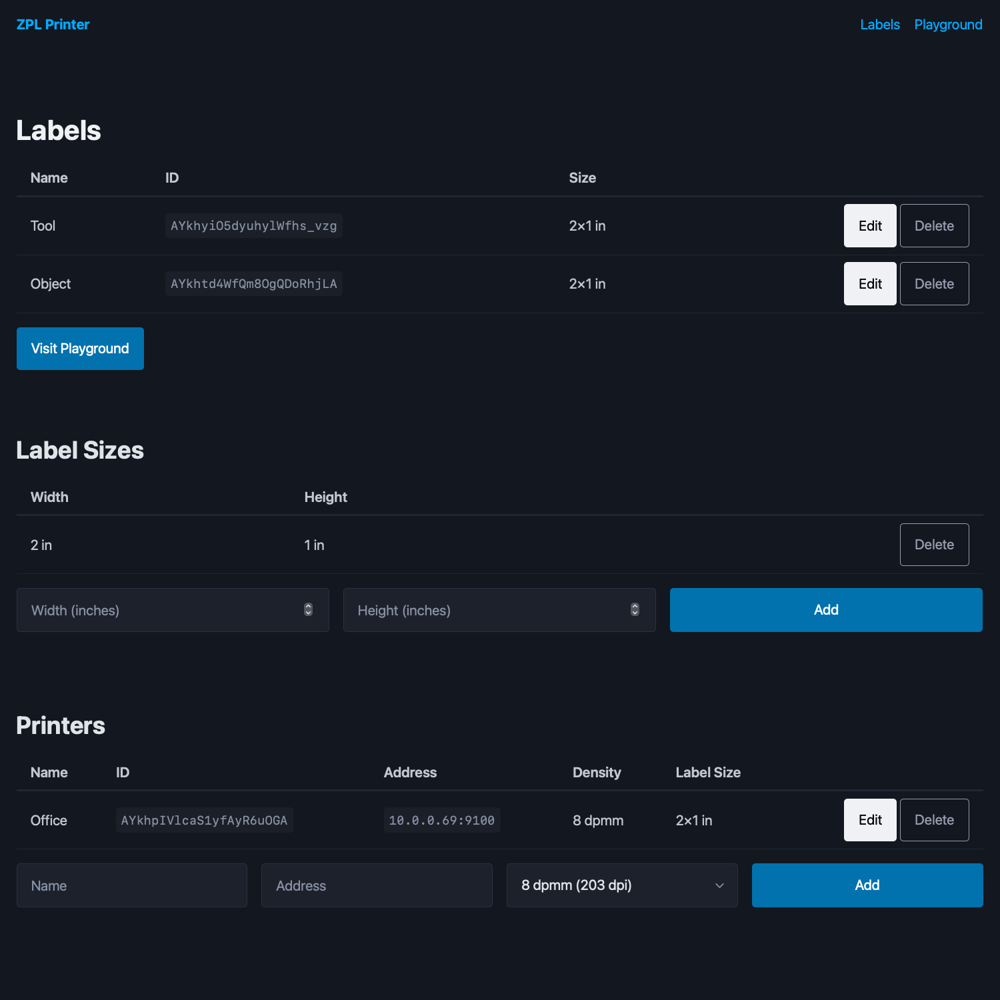

# zpl-printer

A web tool for easily templating and printing ZPL over HTTP. Heavily inspired by
[zpl-rest](https://github.com/mrothenbuecher/zpl-rest/tree/master).

It utilizes the [Tera](https://keats.github.io/tera/docs/#templates) template
engine to construct ZPL.



## Usage

Build with cargo. It depends on PostgreSQL or SQLite to store data, set the
`DATABASE_URL` environment variable before running. The web UI available on port
3000 allows configuring printers, label sizes, and labels.

The playground allows quick iteration of label design thanks to the label
preview service provided by [Labelary](http://labelary.com).

Labels can be saved and then printed via API.

### Host Verification (`^HV`)

When a label template contains the `^HV` command, this tool will automatically
try to parse the output to extract the values. If a suffix is not set, it will
read until the next prefix or assume that the length is fixed.

This feature is not supported when printer is configured using CUPS.

### Alerts

This tool can be configured to record and notify for printer alerts.

When the `alerts_address` option is set, it listens for TCP connections on that
address from printers. Upon receiving an alert, it is saved and forwarded to any
alert targets.

## API

### `GET /api/v1/printers`

List printers.

```jsonc
{
    "printers": [
        {
            "id": "AZw0bQq_cRK-k0G_Vz9eFA", // Internal ID
            "name": "Printer #1",           // Generic name
            "unique_id": "XXXXXXXXXXXXXX",  // Unique ID, or serial number
            "connection_type": "weblink",   // How printer is configured, weblink, network, or cups
            "dpmm": 8,
            "label_size": {
                "id": "AZw0bS3Nd6CIRuCD8skG8A", // Internal ID
                "width": "4",                   // Label width, in inches
                "height": "6",                  // Label height, in inches
            },
            "web_link_certificates": [
                {
                    "id": "AZw0qk9dc9GLLtwZvRJtVg",
                    "created_at": "2026-02-06T20:35:02Z",
                    "expires_at": "2027-02-06T20:35:02Z",
                    "revoked_at": null,
                    "last_ping_at": null,
                    "serial_number": "20:b6:92:a6:cf:2a:0b:5d:5a:eb:7e:0d:76:11:c9:46:46:e2:77:ef",
                }
            ]
        }
    ]
}
```

### `GET /api/v1/printers/:id`

Get a specific printer.

```jsonc
{
    "id": "AZw0bQq_cRK-k0G_Vz9eFA", // Internal ID
    "name": "Printer #1",           // Generic name
    "unique_id": "XXXXXXXXXXXXXX",  // Unique ID, or serial number
    "connection_type": "weblink",   // How printer is configured, weblink, network, or cups
    "dpmm": 8,
    "label_size": {
        "id": "AZw0bS3Nd6CIRuCD8skG8A", // Internal ID
        "width": "4",                   // Label width, in inches
        "height": "6",                  // Label height, in inches
    },
    "web_link_certificates": [
        {
            "id": "AZw0qk9dc9GLLtwZvRJtVg",
            "created_at": "2026-02-06T20:35:02Z",
            "expires_at": "2027-02-06T20:35:02Z",
            "revoked_at": null,
            "last_ping_at": null,
            "serial_number": "20:b6:92:a6:cf:2a:0b:5d:5a:eb:7e:0d:76:11:c9:46:46:e2:77:ef",
        }
    ]
}
```

### `POST /api/v1/printers/:id/print`

Prints a label. It requires a JSON-encoded body with the following contents:

```jsonc
{
    "label_id": "",   // The label's ID
    "data": {}        // Arbitrary key-value data passed to label's template
}
```

If the label template does not contain any `^HV` commands, no response body will
be sent and the status code will be 204.

If the template does contains an `^HV` command, and it was possible to parse the
values, they will be returned and the response will have a status code of 200:

```jsonc
{
    "verifications": [
        [ // Each printed label will have an entry
            { // And each entry is key/value pairs of the field ID and value
                "1": "value"
            }
        ]
    ]
}
```

Responses also set a `x-history-id` header with the ID of the saved history
object.

### `POST /api/v1/printers/:id/send`

Send raw data to the printer without any processing.

Returns a 204 No Content on success.

## Weblink

This service can provide an endpoint for Weblink connections. After generating
your secret and certificate authority, you can use the web UI to issue
certificates for printers. Printers can then be configured to connect to the
Weblink address with a path of `/weblink`.

Note that if you do not configure a dedicated Weblink address, the main address
will start listening over TLS.
